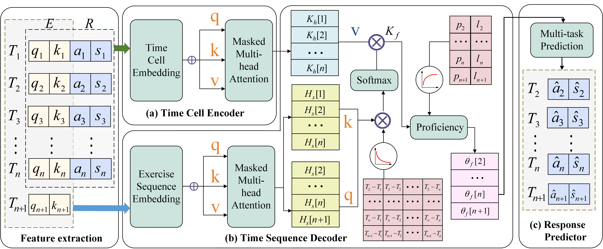

# Response Speed Enhanced Fine-grained Knowledge Tracing: A Multi-task Learning Perspective
The code is related to the paper [Response Speed Enhanced Fine-grained Knowledge Tracing: A Multi-task Learning Perspective](https://www.sciencedirect.com/science/article/abs/pii/S095741742302609X).

# Overview

The FKT model consists of three modules: a time cell encoder, a time sequence decoder, and a response predictor. Specifically, when predicting a learner’s future performance, (1) the time cell encoder encodes the historical learning trajectory to obtain the historical knowledge state of the corresponding time cell; (2) the time sequence decoder simulates the retrieval process of the historical knowledge state when answering future exercises through time-distance attention and obtains the latent trait to answer in the future through knowledge proficiency; and (3) the response predictor obtains the response speed and response answers with a multi-task objective function, promoting fine-grained knowledge tracing.



# Requirements

- pytroch

# Usage

## Datasets
We cut thousands of lines from the complete Junyi data set to create the Junyi_for_testing dataset for code testing.
The complete dataset can be downloaded from the link below.

[Ednet](http://ednet-leaderboard.s3-website-ap-northeast-1.amazonaws.com/)

[Junyi](https://pslcdatashop.web.cmu.edu/DatasetInfo?datasetId=1198/)

[ASSIST2012](https://sites.google.com/site/assistmentsdata/2012-13-school-data-withaffect)

[ASSISTChall](https://sites.google.com/view/assistmentsdatamining/)

## Train
```
python -u train.py --dataset junyi_for_testing --gpu 0
```

# Citation
If our code is helpful to your work, please cite:
```
@article{HUANG2024122107,
title = {Response speed enhanced fine-grained knowledge tracing: A multi-task learning perspective},
journal = {Expert Systems with Applications},
volume = {238},
pages = {122107},
year = {2024},
issn = {0957-4174},
doi = {https://doi.org/10.1016/j.eswa.2023.122107},
author = {Tao Huang and Shengze Hu and Huali Yang and Jing Geng and Zhifei Li and Zhuoran Xu and Xinjia Ou},
keywords = {Knowledge tracing, Learning trajectory, Multi-task learning, Transformer, Response speed},
}
```
